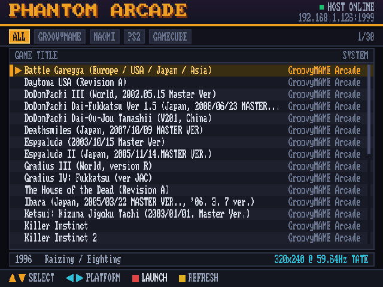
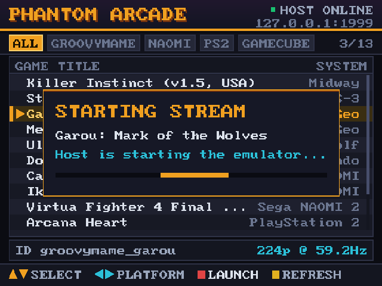
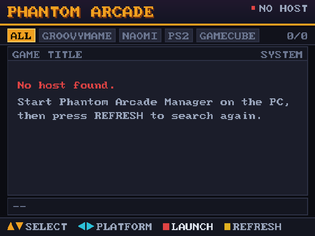
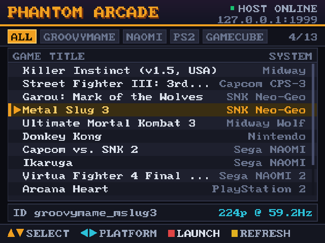

# Phantom Arcade

A MiSTer core that is also an arcade launcher.

Load it and the cabinet shows your PC's game library on the CRT at 15kHz. Pick a title with
the stick, the PC starts GroovyMAME (or Flycast, PCSX2, Dolphin, RetroArch) and streams the
frames straight into the FPGA. Quit, and you are back on the list.

There is no script to run, no second core to switch to, and nothing to keep in sync. The
launcher is part of the core's own program.



*Read out of the DE10-Nano's DDR3 while the core was running — see [Verifying it](#verifying-it).*

---

## What this is

Two projects, merged:

- **[GroovyNLC](https://github.com/verbst/Groovy_MiSTer)** (verbst's fork of
  [psakhis/Groovy_MiSTer](https://github.com/psakhis/Groovy_MiSTer)) turns a MiSTer into an
  analog GPU: a PC emulator sends each frame over Ethernet and the FPGA scans it straight
  out to the CRT. Its own documentation is in [docs/GroovyNLC.md](docs/GroovyNLC.md).

- **[Phantom Arcade](https://github.com/retrorepair/Phantom-Arcade)** was the front end for
  it: a game menu on the MiSTer, a daemon on the PC, and the plumbing between them.

Phantom Arcade used to be a framebuffer program launched from **Scripts**, under the menu
core. Choosing a game made it fork a detached child, write `load_core Groovy.rbf` to
`/dev/MiSTer_cmd`, and exit so MiSTer would unblock and reprogram the FPGA — while that
child slept a configurable number of seconds and then told the PC to start the emulator.
The sleep was a guess at how long FPGA reconfiguration takes. Guess low and the PC started
streaming into a core that did not exist yet; guess high and every launch cost six seconds.

That is what has gone. The launcher now lives inside the Groovy core's own HPS binary, so:

| | Before | Now |
|---|---|---|
| Files on the SD card | `Groovy.rbf`, `Phantom_Arcade.rbf`, `Phantom_Arcade.sh`, `phantom_mister_frontend`, `MiSTer_groovy` | `Phantom_Arcade.rbf`, `MiSTer_phantom` |
| Starting it | Scripts → Phantom_Arcade | load the core |
| Picking a game | switch cores, sleep *n* seconds, hope | send one datagram |
| Returning from a game | script relaunches the menu | the core was never anywhere else |
| Launch delay | 3–6 s, configurable, a guess | none |

The handover is now driven by the real event. The core sits on the launcher until the
host's first frame arrives, and that frame is what takes the screen — the same code path
Groovy already used to drop its screensaver.

## Install

Three things, and one line of configuration.

1. Copy `build_output/Phantom_Arcade.rbf` to `/media/fat/_Utility/`.
2. Copy `build_output/MiSTer_phantom` to `/media/fat/` and `chmod +x` it.
   If you use FTP, transfer in **binary** mode.
3. Add this to `/media/fat/MiSTer.ini`:

   ```ini
   [GroovyNLC]
   main=MiSTer_phantom
   ```

   The section name is `GroovyNLC` and not `PhantomArcade` because MiSTer matches it
   against the core name baked into the bitstream, not the `.rbf` filename. The `.rbf` can
   be called anything you like; the section cannot. (`[Groovy*]` also works and matches a
   stock Groovy install too.)

Then on the PC, run `build_output/PhantomArcadeManager.exe`, point it at your emulators and
ROM folders, press **Auto-Scan ROMs**, and press **Start Background Daemon**.

Nothing else — there is no address to configure at either end. The cabinet opens every
conversation, so the daemon takes the MiSTer's address from the datagrams it receives and
hands that to GroovyMAME as `-mister_ip`. It follows the cabinet across DHCP leases by
itself, and the manager shows the address it discovered rather than offering a box to
type one into.

The port is the one thing that cannot be discovered, since discovery has to arrive
somewhere. Both ends therefore agree on **1999** in advance. It is not a control either,
because changing it on one side alone silently breaks discovery — a far likelier mistake
than a clash on 1999. If something else really does own that port, change it in both
`phantom_config.json` (`udp_port`) and `phantom.ini` (`UDP_PORT`) together.

Auto-Scan asks MAME which sets will actually start, and lists only those. Incomplete
romsets (`mame -verifyroms` calls them bad) and entries that are not games at all —
devices and BIOS images like `hd44780` or `model1io`, which live in roms folders quite
legitimately — are left out. They would otherwise sit in the menu and fail the instant
anyone chose one, which from the cabinet looks exactly like a broken stream.

If your network drops broadcast, you can still name the host in
`/media/fat/config/phantom.ini`:

```ini
[SERVER]
PC_SERVER_IP=192.168.1.100
UDP_PORT=1999

[LAUNCHER]
IDLE_SCREEN=launcher   ; launcher | logo | off
EXIT_HOTKEY=on
```

### Upgrading from a Groovy install

Nothing to do. The core name has not changed, so your `GroovyNLC.CFG`, your input maps and
your per-core `MiSTer.ini` settings all still apply. Point `main=` at `MiSTer_phantom`
instead of `MiSTer_groovyNLC` and everything else carries over.

### If you preferred the bouncing logo

OSD → System → Phantom Arcade → **Idle screen: Logo**. That restores the original Groovy
screensaver exactly, including its existing Server → Screensaver switch. The launcher is
only the default, not the only option.

## Using it

| Control | Does |
|---|---|
| Up / Down | move through the list (hold to accelerate) |
| Left / Right | change platform tab |
| Button 1 | launch the highlighted game |
| Start | search for the host again and refresh the catalog |
| Start + Select, held 1.2 s | stop the game and come back to the launcher |

To get back to the menu there is also **OSD → System → Phantom Arcade → Return to
launcher**, which does the same thing.

Either route does two things, and both are needed. It tells the host to kill the
emulator, and it closes the session from the core's side. Without the second half the
menu would never come back: the core's idle timeout may only reap a client that
advertised the keepalive capability, and GroovyMAME advertises none, so an emulator that
was killed outright never sends `CMD_CLOSE` and the CRT would hold its last frame
indefinitely.

Keyboard equivalents: arrows, Enter/Space, Esc, F5.

The OSD gains a **Phantom Arcade** page (System → Phantom Arcade) showing the host address,
link state and title count, with the idle-screen choice, the exit hotkey toggle, and
buttons to search for the host or stop the emulator.



## How it works

The core already had everything needed; almost nothing new talks to the hardware.

```
   DE10-Nano                                              PC
   ┌──────────────────────────────┐                   ┌─────────────────────┐
   │ MiSTer_phantom (ARM)         │                   │ PhantomArcadeManager│
   │  ┌────────────────────────┐  │  LAUNCH:<id>      │                     │
   │  │ Phantom Arcade launcher│──┼──── UDP :1999 ───▶│  starts GroovyMAME, │
   │  │  720x480 canvas        │◀─┼──── catalog ──────│  Flycast, PCSX2 ... │
   │  └───────────┬────────────┘  │                   └──────────┬──────────┘
   │              │ memcpy        │                              │
   │        DDR3 framebuffer      │◀───── Groovy video UDP :32100 ┘
   │              │               │
   └──────────────┼───────────────┘
                  ▼
            Groovy.rbf  ──▶  15kHz RGB / JAMMA
```

- **The screen.** When no client is streaming, Groovy used to show a bouncing logo. That
  state has three hooks — enter, leave, tick — and the launcher takes them over. It renders
  a 720×480 canvas and the core scans it out; when a stream starts, the launcher hands the
  screen back.

- **The video mode.** 720×480 with `interlace=2`, which Groovy reads as *interlaced output,
  progressive framebuffer*: the HPS hands over one whole frame and the FPGA produces the two
  fields. At 14.655 MHz that is 935 × 523 → **15.67 kHz / 59.92 Hz**, an ordinary 15kHz 480i
  signal. It is programmed through `setSwitchres()`, the same call a PC client's
  `CMD_SWITCHRES` goes through, so the PLL maths and the FPGA handshake are the shared,
  tested ones. The geometry is the repo's own 480i test mode from
  `sim/compare_nlc_modes.sh`, not a new one.

- **Interlace discipline.** A one-pixel-tall feature lands in a single field and blinks at
  30 Hz. So text is never drawn below 2× scale, rules are 2 or 4 px, and nothing relies on
  an odd-height edge. Pure white is avoided for the reason `tools/gen_logo.py` already
  documented: at Y=100% it strobes on these monitors.

- **Drawing.** The launcher renders into ordinary cached RAM and the finished frame is
  copied to DDR in one `memcpy`. The DDR window is mapped uncached, so building a screen
  out of thousands of small writes directly in it is both very slow and visibly
  half-finished — the core re-reads that buffer every frame.

- **Input.** `user_io_digital_joystick()` and the keyboard path offer events to the
  launcher first. While it is on screen it consumes them, so navigating the menu does not
  also type into whatever the PC has focused. While a stream is running it only watches for
  the exit hold.

### Why there is no new FPGA build

Everything above is in the ARM binary. The bitstream is byte-for-byte upstream's, which
means a Groovy user can drop in one file to try this, and a Quartus rebuild is not part of
anyone's install. The OSD page is built in `menu.cpp` rather than in `Groovy.sv`'s
`CONF_STR` for the same reason — the fork's existing Controllers page already works this
way.

## Building

```bash
./tools/build_phantom_hps.sh          # -> build_output/MiSTer_phantom
```

It fetches ARM's `arm-none-linux-gnueabihf` 10.2-2020.11 on first run, checks out the
pinned Main_MiSTer commit, overlays `hps_linux/src`, and builds. The compiler version is
pinned deliberately: 10.3 cannot allocate registers for Main_MiSTer's inline-asm RBF copy
loop and fails with `'asm' operand has impossible constraints`.

The PC daemon:

```bash
x86_64-w64-mingw32-g++ -O2 -std=c++17 -static -municode -mwindows \
    host/PhantomArcadeManager.cpp -o build_output/PhantomArcadeManager.exe \
    -lws2_32 -lshlwapi -lcomctl32 -lole32
```

## Verifying it

The launcher's drawing and navigation have no hardware or socket dependencies
(`phantom_ui.c`), so they build with the host compiler:

```bash
gcc -O2 -Wall -Wextra -Ihps_linux/src/support/groovy \
    -o /tmp/t tools/phantom_ui_test.c hps_linux/src/support/groovy/phantom_ui.c && /tmp/t
# 332 checks, 0 failures

gcc -O2 -Ihps_linux/src/support/groovy -o /tmp/p \
    tools/phantom_preview.c hps_linux/src/support/groovy/phantom_ui.c
/tmp/p out.ppm --busy          # render any screen to a file and look at it
```

On the MiSTer itself, the HPS and the FPGA share the board's DDR3, so what the core is
actually displaying can be read straight out of memory — no capture card:

```bash
python3 tools/mister_fbdump.py /tmp/fb.ppm 720 480     # run on the MiSTer
python3 tools/mister_inject.py down down enter         # drive it with a synthetic pad
python3 tools/phantom_test_host.py                     # a host daemon that starts nothing
```

Every screenshot in this README was produced that way, on hardware.

| | |
|---|---|
|  |  |

`tools/mister_serial.ps1` talks to the HPS console over the DE10-Nano's USB UART, which
keeps working when the network and the screen do not.

## Known limits

- **AF_XDP build.** `tools/build_phantom_hps.sh xdp` reports that it cannot build it. The
  Makefile adds `-I./support/groovy/kernel/usr/include`, and that directory is not in the
  repository — true of upstream too, and nothing to do with the launcher. The UDP binary is
  what the install instructions use; XDP additionally needs a patched kernel, a BPF object
  and `libelf` on the MiSTer.
- **Catalog size.** The host serves the catalog in one UDP datagram, capped at 60000 bytes
  on its side, so a very large library will arrive truncated. The core's parser stops
  cleanly at the last complete record rather than showing a corrupt one, but the fix
  belongs on the host and is not done yet.
- **Timings in the detail bar** come from the host's `videoMode` string. The host does not
  send real modeline numbers, so the core shows what it was given and nothing more — it
  does not fill in a plausible 15.734 kHz that might be wrong for that title.

## Credits and licence

- The core, and the whole idea of streaming frames into an FPGA, are
  **[psakhis/Groovy_MiSTer](https://github.com/psakhis/Groovy_MiSTer)**.
- NLC compression, the connection handling, the controller work and the OSD Controllers
  page are **[verbst/Groovy_MiSTer](https://github.com/verbst/Groovy_MiSTer)**.
- The launcher's look, its palette, its 8×12 font and the PC daemon are
  **[retrorepair/Phantom-Arcade](https://github.com/retrorepair/Phantom-Arcade)**.
- Built on **[MiSTer-devel/Main_MiSTer](https://github.com/MiSTer-devel/Main_MiSTer)**.

Groovy_MiSTer is GPL-2.0 and this is a derived work, so **the combined work is GPL-2.0**
(see [LICENSE](LICENSE)). Phantom Arcade's contributions were MIT, which is compatible;
the files taken from it say so at the top.
